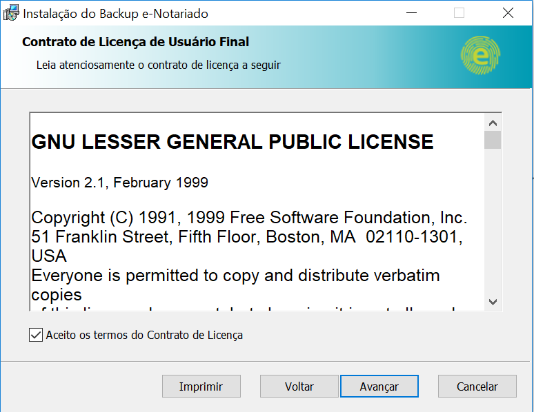
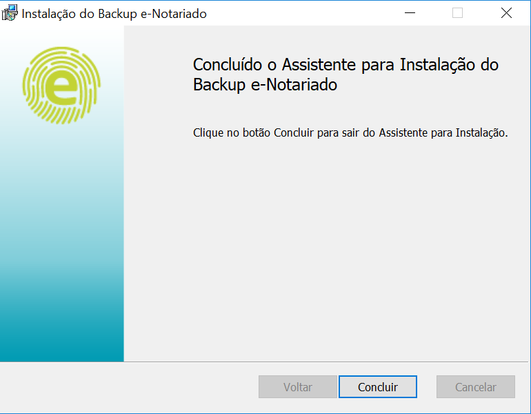

# Instalação

## Componentes da Aplicação

Antes de instalar a aplicação, é necessário saber os diferentes componentes que a compões e como eles se relacionam e podem ser configurados.

#### **O Serviço**  

Esta é a parte principal da aplicação. Quando instalada, ela é registrada como um serviço do Windows, um pequeno agente inicia o servidor da aplicação e está em constante comunicação para verificar sua atividade. Se o servidor para de responder, o agente irá reiniciá-lo.

Quando um backup é feito, a aplicação terá permissões de administrador, desse modo é possível realizar o backup de arquivos pertencentes a qualquer usuário da máquina. É recomendado configurar uma senha de acesso à interface do usuário para proteger usos indevidos por usuários.

#### **O servidor**  

O agente do serviço inicia o servidor, que é capaz de realizar tarefas no plano de fundo como realizar backups, restaurações e tarefas de manutenção.

Este servidor também tem um agendador integrado que inicia backups automaticamente em intervalos definidos pelo usuário. Também é este o componente que possibilita o uso da interface web.

#### **As ferramentas de linha de comando**  

A aplicação também pode fazer backups sem carregar o servidor, usando as ferramentas de linha de comando. Para agendar backups sem usar o servidor, é necessário usar um agendador externo como o Windows Task Scheduler.

As ferramentas de linha de comando também ajudam com operações de restauração, recuperação, atualização, reparação, etc.

É útil para integrar a aplicação com a execução de scripts personalizados.

#### **O ícone de bandeja**  

A aplicação é instalada como um serviço do Windows, isto significa que ela é executada no plano de fundo, sem que seja necessário algum usuário estar logado para executar a aplicação.

O ícone de bandeja é um pequeno programa a parte que se conecta com o serviço, podendo se comunicar com ele. Sua utilidade se resume em ter um ícone de fácil acesso para abrir a interface web da aplicação, sendo também possível pausar/resumir a aplicação como um todo por ele.

Vale notar que clicar no ícone de bandeja e depois em _Sair_ não irá interromper a execução da aplicação, apenas terminará a execução do ícone de bandeja.

## Pré-requisitos

*****
 A aplicação depende de outros softwares. No Windows, Microsoft .NET Framework 4.5 ou superior precisa estar instalado.

Se seu sistema possui uma versão antiga da .NET Framework (ou não tem ela instalada), baixa a última versão em [https://www.microsoft.com/net/download/framework](https://www.microsoft.com/net/download/framework) e a instale.

Para realizar o backup de arquivos que estão em uso por outro processo, a aplicação usa AlphaVSS. Este módulo precisa de componentes do Visual C++ Run-time para Visual Studio 2017. Faça o download e a instalação em [Microsoft Visual C++ Redistributable for Visual Studio 2017](https://go.microsoft.com/fwlink/?LinkId=746572), link encontrado na página [https://visualstudio.microsoft.com/downloads/](https://visualstudio.microsoft.com/downloads/). 

*****

## Baixando a aplicação

A instalação pode ser baixada no [Portal do Backup e-notariado](https://backup.e-notariado.org.br/welcome). Para baixar diretamente, clique [aqui para a versão 64 bits](http://cdn.e-notariado.org.br/backup-client/installers/backup-enotariado.msi) e [aqui para a versão de 32 bits](http://cdn.e-notariado.org.br/backup-client/installers/backup-enotariado_32bit.msi).

## Instalando

*****
 O procedimento de instalação é bem simples. Faça o download do instalador no link acima.

O primeiro passo é a tela de boas-vindas. Clique em Avançar para prosseguir

Leia o Contrato de Licença. Se concordar, selecione _Aceito os termos do Contrato de Licença_ e clique em Avançar.
Read the license agreement. If you agree, select _I accept the terms in the License Agreement_ and click Next.

Esta tela mostra quais componentes são instalados, todos obrigatórios. O primeiro se trata da instalação total da aplicação e o segundo de sua inicialização automática quando o computador inicia. Note que a aplicação é sempre instalada como um serviço, então não é possível desmarcar a inicialização automática.

Clique em Avançar para prosseguir.

Clique em Instalar pra começar a instalação, será necessário dar permissões de administrador.

Espere que a instalação termine.

Clique Concluir para completar a instalação.

